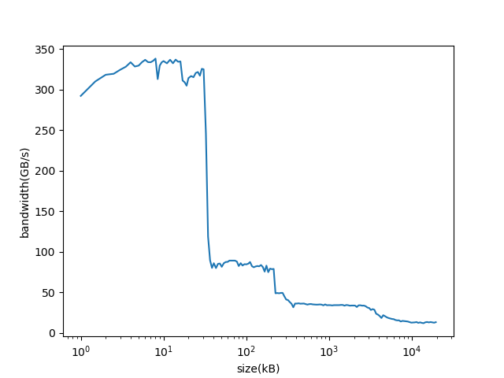
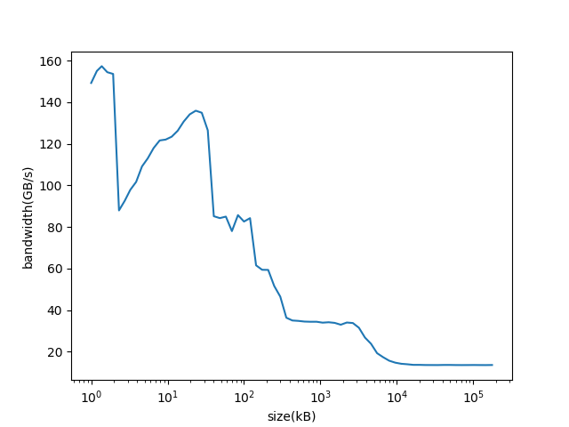
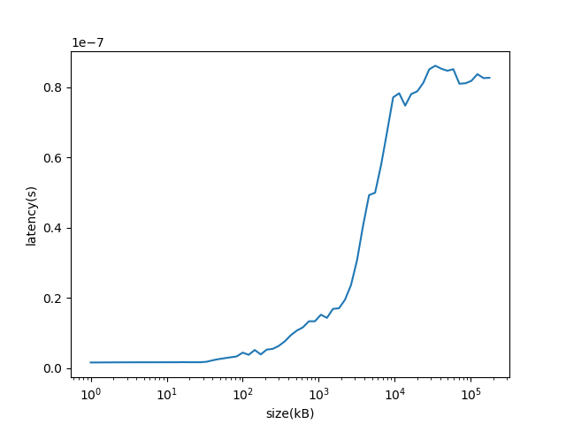

# memmeter

experiments with memory

## Instalation

https://github.com/realead/timeitcpp is used as submodule, thus clone it with git clone --recursive.

## Prerequisites

  1. g++-compiler, c++11 (tweak `sh run_test.sh` if you use another c++11-capable compiler).
  2. python + pandas + matplotlib, for creating result-charts.

## band width

My machine (an Intel-Broadwell)  can do about 10^9 double-multiplications per second, that means at most 8GB/s per single processor. But data is fetched in 64bytes, so stepping over 7 doubles and utilizing only 8 bytes we'll get to 64 GB/s. 

Even better, an integer addition can be done in 0.35 nano-seconds thus leading to maximal band width of 182 GB/s. There is no pipeling for integer-addition (as compared to float-addition), so we don't have to watch out for dependencies on the prefivious results.

Running `sh run_test.sh band_width` we get the following results (will be saved in `src/output_test_band_width.png`, `src/output_test_band_width.txt`)
):

Results per single thread:

    Memory type     Size         Speed (GB/s)
    L1 Cache:       32kB          310            *there are not really 64 byte fetched,  so 310 isn't really valid
    L2 Cache:      128(256)kB      80            *For whatever reason the second 128k of 256kB L2-cachel are not that easily utilized
    L3 Cache:        4MB           35
    RAM:             XXX           13

There are some things worth mentioning:

  * drop of speed for L1->L2 is more abrupt than L2->L3, it seems as if L1 were not shared between threads, but L2 is (at least to some degree)
  * L3 seems to be shared among all processors/threads

I'm not really sure that for L1-cache the task is bandwidth bound. At least it is important to unroll the inner loop, otherwise 2 addition and not one addition are needed per memory access. There is also an issue with branch misses which leads to a performance drop if inner loop has around 32 interation:

See https://stackoverflow.com/q/53751321/5769463 for more details

## latency

Prefetcher are damn good nowdays! To trick it out we prepare a single-cycle (so really whole memory is visited) permutation and tranverse trough it. Because of the randomness and dependency of the next step on the currently fetched data there is nothing that the prefetcher can do.

Running `sh run_test.sh latency` we get the following results (will be saved in `src/output_test_latency.png`, `src/output_test_latency.txt`):

Results per single thread:

    Memory type     Size         Latency (in ns)
    L1 Cache:       32kB          1.6          *4-5 times slower than move between registers
    L2 Cache:      128(256)kB     4.5          *3 times slower than L1-cache
    L3 Cache:        4MB           40          *almost 10 times slower than L2-cache
    RAM:             XXX           80          *2 times slower than L3-cache, 50 times slower than L1-cache and 200 times slower than register-move

There are some things worth mentioning:

  * it is not easy to fool the prefetcher!
  * the experiments don't show such a clear picture, ther real latencies are probably somewhat higher (or should be taken at the and of the memory size for a cache-type, because random access might be cached)
